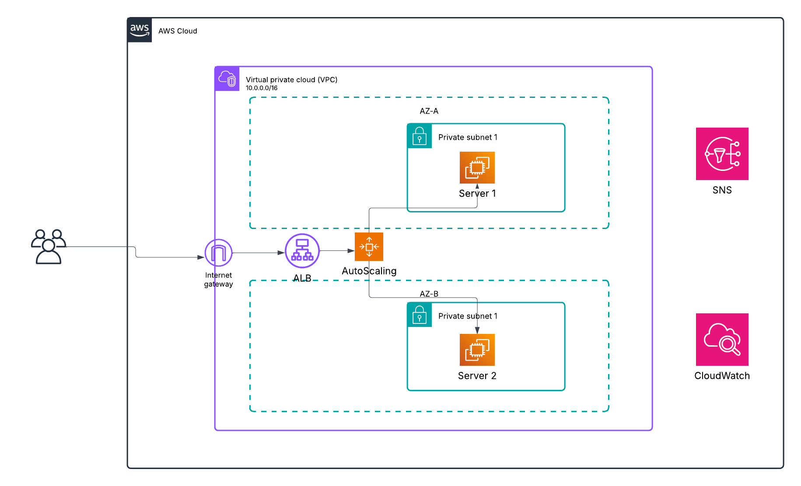
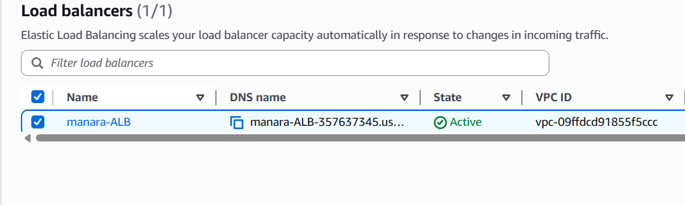
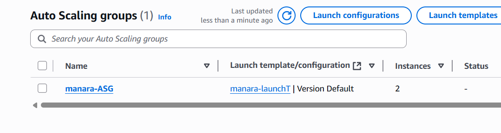
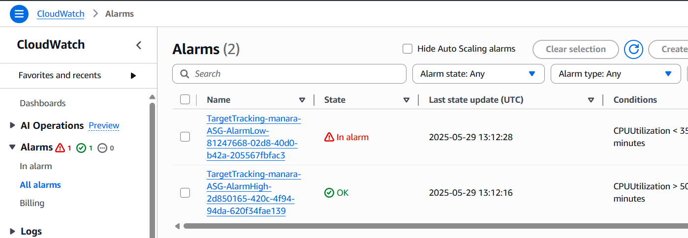
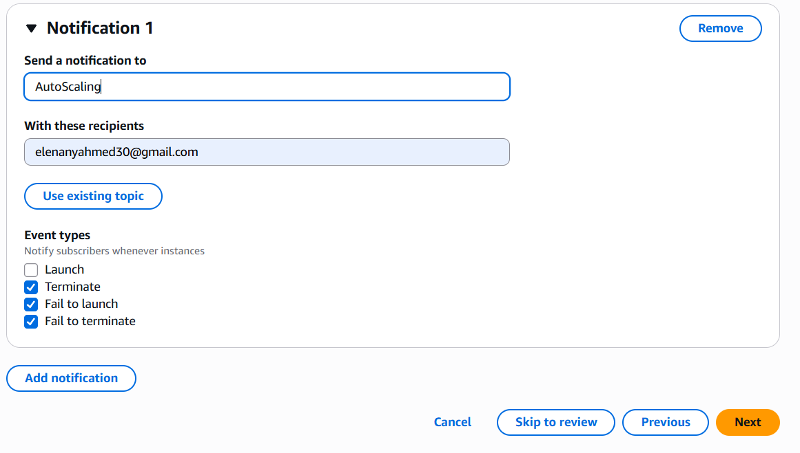
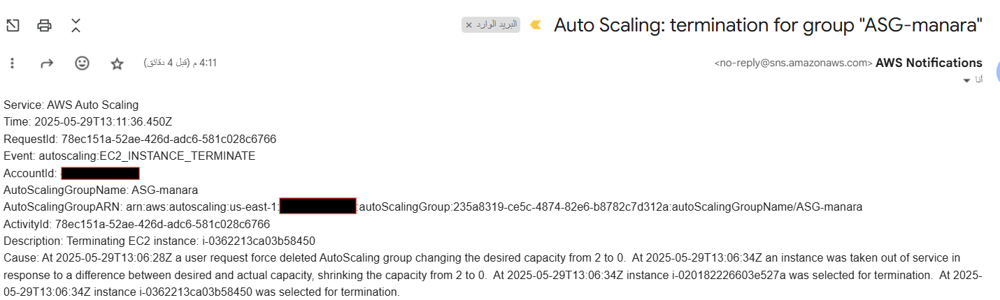
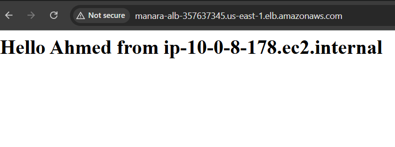
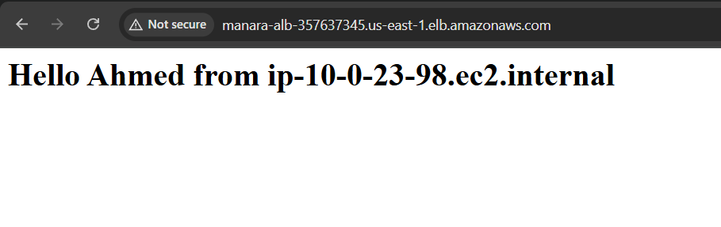

# aws-manara-project

- Designing and Deploying a simple web application on AWS using EC2 instances, ensuring high availability and scalability with Elastic Load Balancing (ALB) and Auto Scaling Groups (ASG). 

## Key AWS Services Used:
- EC2: Launch instances for the web app.
- Application Load Balancer (ALB): Distributes traffic across multiple instances.
- Auto Scaling Group (ASG): Ensures instances scale based on demand.
- CloudWatch & SNS: Monitor performance and send alerts
- IAM: Role-based access to instances.

## Setup

### Application Load Balancer

### Auto Scaling Group

 

### CloudWatch

 

### Simple Notifications Service 

 

 

### EC2 Targets

 

 

## Implementation Steps

- Configure and Setup Security group(SG) that allows only ALB's SG as an Inbound rule to EC2 SG 
- Setup and Implement ALB and Attach its Security Group
- Configure ASG as a target listner 
- Creating and attach lanuch template to ASG 
- Using ALB DNS Name to test connectivity.